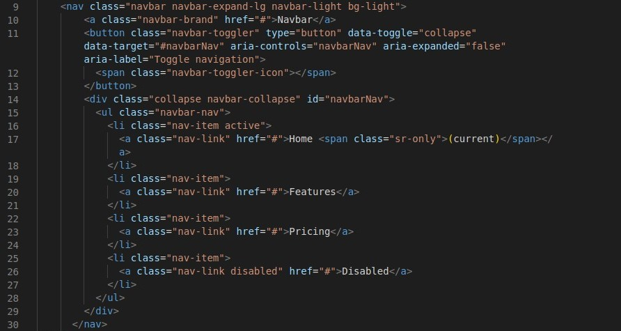
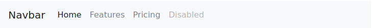
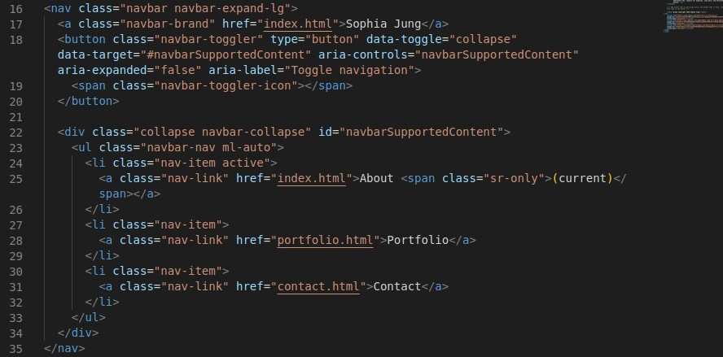
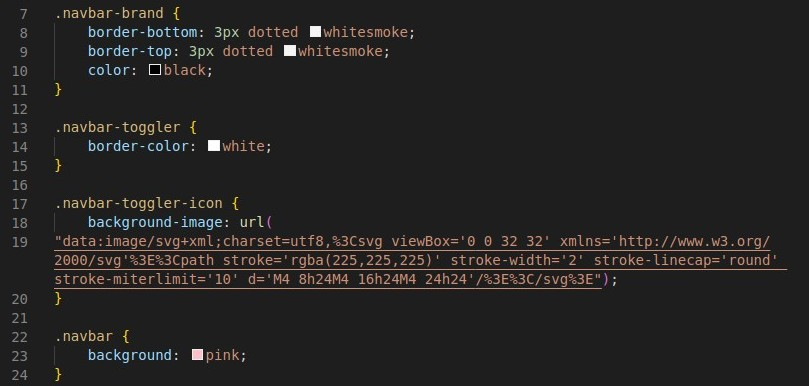
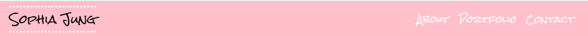

# Responsive Bootstrap Portfolio

## Description 

This repository is comprised of a three page portfolio website that includes an About Me, Portfolio/Picture, and Contact page. Each page is styled with a CSS file and incorpoates Bootsrap utilities (https://getbootstrap.com/docs/4.0/getting-started/introduction/). The code also focuses on using responsive images, proper grid layout formatting, and mobile accessibility. In this way, HTML and CSS coding had to be aware of necessary changes as screen size increased or decreased. 

There was no additional Javascript added to this code aside from what was linked from the Boostrap library. 

The Bootstrap content and components used in this portfolio are a Navbar, a Form, and Responsive Images. Additional features include, hover image text, social media links and icons, Google Fonts, and a sticky footer.

## Usage 

This repository can be used to practice additional styling or adding of elements while adhering to mobile accessibility, grid layout, and screen resizing. 

The existing code also can also serve as an example of how to edit existing Bootstrap styling to fit one's needs. 

Example:

Original from Bootstrap

Customized Code with Accompanying CSS Styling (Does NOT include Google Fonts embed code)

